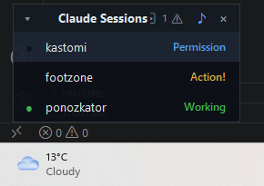

# Claude Session Monitor

A tiny always-on-top widget for Windows that shows every running
[Claude Code](https://claude.com/claude-code) session and, at a glance, whether
each one is **working**, **needs your permission**, or is **waiting for your
reply**.

If you keep several Claude Code sessions open across different projects, it's
easy to lose track of which one is blocked on you. This widget keeps a small
box in the corner of your screen so you always know where your attention is
needed — and one click jumps you straight to that window.



## Features

- **Live status per session** — Permission! (blue), Action! (amber), Working (green)
- **Sorted by urgency** — sessions that need you float to the top
- **Stale statuses are dimmed** — a green *Working* that nothing has refreshed
  for a couple of minutes fades and picks up its age (`8m`), so a session whose
  hooks quietly stopped arriving no longer looks busy
- **Click to jump** — click a row to bring that session's terminal/editor window
  to the front (restores it full-screen if it was minimized)
- **Sound alert** — a gentle chime when a session starts waiting for you;
  toggle it with the `♪` icon in the header
- **Auto-cleanup** — closed sessions disappear even when Claude Code can't run
  its exit hook (e.g. you closed the window), and one window never shows up
  twice even when Claude Code changes a session's id mid-flight
- **Unobtrusive** — frameless and collapsible to a thin strip; drag the header
  to move it and the right edge to resize it, and it remembers both
- **Tray icon** — a coloured dot in the notification area showing the most
  urgent status across every session; click it to hide or show the box, so you
  can run in the tray alone
- **One instance** — launching it again (Startup shortcut plus an impatient
  double-click) brings up nothing rather than a second box on top of the first
- **Sharp on scaled displays** — laid out for the monitor's DPI instead of
  being stretched by Windows
- No dependencies beyond Python's standard library

## Requirements

- Windows 10/11
- [Claude Code](https://claude.com/claude-code) (CLI or the VS Code extension)
- Python 3.8+ on your `PATH` (`python --version`)

## Install

```powershell
git clone https://github.com/sochorthomas/claude-session-monitor.git
```

Then **double-click `install.cmd`**, or from a terminal:

```powershell
cd claude-session-monitor
powershell -ExecutionPolicy Bypass -File .\scripts\install.ps1
```

Either way `install.ps1` registers the hooks in `~/.claude/settings.json`. It
only touches its own entries — your other settings, your other hooks, and even
your own hooks on the same events are left alone — and it is safe to re-run. It
finishes by running the hook exactly the way Claude Code will, so a broken
install says so instead of looking like an empty box. Then:

1. **Reload Claude Code** so it picks up the new hooks
   (VS Code: `Ctrl+Shift+P` → *Developer: Reload Window*).
2. **Start the widget** — double-click `start-monitor.vbs`.

New sessions now show up in the box automatically.

### Launch at login (optional)

Press `Win+R`, type `shell:startup`, and drop a shortcut to `start-monitor.vbs`
into that folder.

## How it works

Claude Code fires [hooks](https://docs.claude.com/en/docs/claude-code/hooks) on
lifecycle events. Each hook runs `hook.py`, which writes that session's status
to `~/.claude/session-status/<session_id>.json`. The widget (`widget.pyw`) reads
those files twice a second and renders the box.

| Claude Code event   | Status       | Color        |
| ------------------- | ------------ | ------------ |
| `UserPromptSubmit`, `PostToolUse` | **Working** | 🟢 green |
| `Stop`, `SessionStart` | **Action!** (waiting for your reply) | 🟡 amber |
| `PermissionRequest` | **Permission!** (waiting for approval) | 🔵 blue |
| `Notification` | either of the two above, see below | 🔵 / 🟡 |
| `SessionEnd`        | *(removed from the list)* | — |

`Notification` fires both when a tool needs approving and when the session has
just gone quiet, so the event name alone can't tell those apart. `hook.py` reads
the notification message to decide, instead of labelling every idle session as
waiting for approval.

The sound plays only when an already-known session transitions into a
"waiting for you" state, so opening a new session doesn't beep.

Hooks run on every tool call, so `hook.py` is kept cheap: it does no
subprocesses, and it finds the owning `claude` process by walking the parent
chain (a few `OpenProcess` calls) rather than enumerating every process on the
machine — which measured 0.4–1.4 s against under a millisecond. `install.ps1`
also resolves the interpreter up front and writes it straight into the hook
command, so a hook is one process instead of a PowerShell that goes looking for
Python each time.

### One row per window

Claude Code doesn't always keep one session id for the life of a window: it can
announce a `SessionStart` under one id and then run the conversation under
another, or rotate the id on resume/compact — in both cases without a
`SessionEnd`, leaving an abandoned status file that would show up as a second
row for the same project. The hook therefore also records the pid of the
`claude` process it was fired from, and the widget uses it to keep the list
honest:

- **one Claude process = one session** — if two status files share a pid, only
  the most recently updated one is shown, the other is deleted;
- **no transcript = never really started** — a session that has no
  `~/.claude/projects/<project>/<session_id>.jsonl` and has received no hook for
  `GHOST_AFTER` seconds (3 min) is dropped;
- **dead process = finished session** — the row goes away when the `claude`
  process exits, which is more reliable than matching window titles (that
  fallback is still used for status files written by an older `hook.py`).

Consequence worth knowing: a window you open but never type into disappears
from the list after ~3 minutes, and comes back the moment you send a prompt.

### When a status goes stale

A status file only changes when a hook fires, so a row is really "the last thing
Claude Code told us", not "what is happening now". After `STALE_AFTER` seconds
(2 min) without an update the row fades and shows its age — either the session
is deep in one long tool call, or its hooks have stopped arriving and the row is
lying to you. Both are worth seeing.

**Action!** and **Permission!** are exempt: those are states a session sits in on
purpose while it waits for you, sometimes for hours, so ageing them would dim
exactly the rows you care about.

### Repository layout

The root holds what you double-click and the two programs themselves;
everything the launchers call lives in `scripts/`.

```
install.cmd               register the hooks (double-click this)
uninstall.cmd             remove everything again (double-click this)
start-monitor.vbs         start the widget (double-click this)
widget.pyw                the widget itself
hook.py                   what Claude Code runs on every hook event
scripts/install.ps1       what install.cmd runs
scripts/uninstall.ps1     what uninstall.cmd runs
scripts/start-monitor.ps1 finds Python, launches widget.pyw
```

The `.cmd` files exist because double-clicking a `.ps1` opens it in an editor
rather than running it. They keep the console open so you can read the result,
and `uninstall.cmd` asks before it does anything — the confirmation lives there
rather than in the script, so `uninstall.ps1` stays non-interactive for anything
else that drives it.

## Controls

- **Drag** the header to move the box. It grows upward from wherever you leave
  it, so a new session never pushes it down the screen.
- **Drag the right edge** to change the width.
- **Click a row** to focus that session's window.
- **Hover a shortened name** (one ending in `…`) to see the full project name in
  a tooltip. The status label always keeps its space, so it stays readable no
  matter how long the project name is.
- **`♪`** toggles the notification sound (struck through = muted).
- **Chevron `▾/▸`** (or double-click the header) collapses the box to a strip.
- **`×`** quits. **Right-click** for a small menu, including *Reset position* if
  you lose the box off the edge of a screen.

### The tray icon

A dot in the notification area takes the colour of the most urgent session —
blue, amber, green, or grey when nothing is running — and its tooltip counts
them. **Left-click** hides the box or brings it back; **right-click** opens the
same menu as the box does, so *Reset position* and *Quit* are reachable even
when the box is nowhere to be seen. Whether the box is hidden is remembered, so
you can run in the tray alone.

Windows 11 hides new tray icons behind the `^` chevron by default. Drag it out
onto the taskbar, or use *Settings → Personalization → Taskbar → Other system
tray icons*, to keep it visible.

Position, width and the sound toggle are remembered in
`~/.claude/session-monitor-config.json`. A saved position on a monitor that is
no longer attached is ignored rather than leaving the box off-desktop.

The whole layout is sized from the display's DPI, so it stays proportional at
125% or 200% instead of being bitmap-stretched. Set `CLAUDE_MONITOR_SCALE` (e.g.
`1.4`) to override that and make the box larger or smaller than the automatic
size — it scales the text along with everything else.

## Uninstall

**Double-click `uninstall.cmd`** — it lists what it is about to do and waits for
you to type `Y` (or `K` to keep your saved settings) — or from a terminal:

```powershell
powershell -ExecutionPolicy Bypass -File .\scripts\uninstall.ps1
```

Four steps, each reported as it happens:

1. **Stops the widget** — by asking it to close, so it takes its own tray icon
   with it. Only if it will not go quietly is the process killed.
2. **Unregisters the hooks** — only this tool's entries in
   `~/.claude/settings.json`; your own hooks on the same events survive.
3. **Deletes what the tool wrote** — `session-status/`, the config file and the
   debug log, all under `~/.claude`. Pass `-KeepData` to leave the status
   directory and your saved position, width and sound setting for a reinstall.
4. **Removes a Startup shortcut** — but only one pointing at this copy of
   `start-monitor.vbs`, which would otherwise bring the widget back at the next
   login.

Then reload Claude Code so it stops trying to run the hooks. The repository
itself is left alone — delete the folder to finish.

## Troubleshooting

- **The box shows nothing.** Hooks load when a session starts — reload Claude
  Code (or open a new window). Confirm the hooks are registered by running
  `/hooks` inside Claude Code.
- **Still nothing after reloading.** Check `install.ps1` completed without errors
  and that `python`/`pythonw` are on your `PATH`.
- **One session is missing while others show up.** The hook is probably failing
  in that session only; Claude Code reports it as a non-blocking hook error
  rather than surfacing it. A hook command written by an older `install.ps1`
  starts with a quoted path, which PowerShell parses as an expression instead of
  a command (`Unexpected token '-E'`). Re-run `install.ps1` — the current one
  prefixes the command with the call operator (`&`) and finishes by smoke-testing
  the hook exactly the way Claude Code runs it.
- **Is the hook even running?** Set `CLAUDE_MONITOR_DEBUG=1` in the environment
  Claude Code starts from and watch `~/.claude/session-monitor-hook.log`: a line
  per invocation means the hook ran (and says what it wrote), while *no* line at
  all means Claude Code never managed to start it — a broken hook command, a
  missing interpreter. The hook always exits 0 so it can never block Claude
  Code, which is exactly why those two cases otherwise look identical.
- **It stopped working after I moved or reinstalled Python.** The interpreter
  path is baked into the hook command, so re-run `install.ps1`. Same after
  moving the repository itself.
- **Double-clicking `start-monitor.vbs` does nothing.** If the box is already on
  screen, that is the single-instance guard doing its job. Otherwise make sure
  Python is installed and on `PATH`; to see the error the `.vbs` swallows, run
  the launcher directly: `powershell -File .\scripts\start-monitor.ps1`.
- **Note on the Microsoft Store build of Python:** its process appears as
  `pythonw3.13.exe` (not `pythonw.exe`) in Task Manager — that's expected.

## License

[MIT](LICENSE) © Tomáš Sochor
